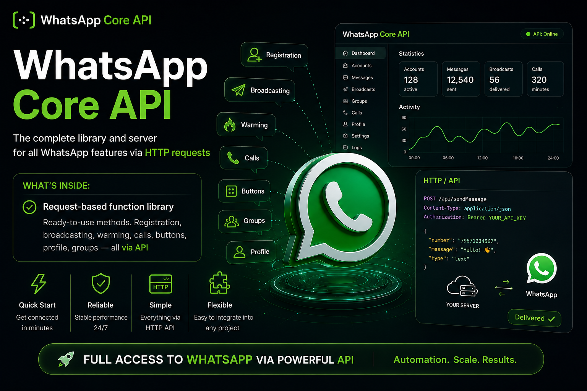

# WhatsApp Core API

> **Commercial product**

A complete library and server package for working with WhatsApp through an HTTP API.

## What is included

- Ready-to-use, request-based API library.
- Server component for HTTP API integration.
- Working Play Integrity Token solution.
- Installation and configuration.
- Training for the product handover.

## Designed for integration

The package is designed to connect WhatsApp capabilities to your own systems through HTTP requests. Product materials describe support for account registration, messaging workflows, calls, buttons, profiles, and groups through the API.

## Delivery

## Contact and purchase

To discuss fit, purchase, delivery format, or implementation details:

- Email: [BotsLab@proton.me](mailto:BotsLab@proton.me)
- Telegram: [@TheBotsLab](https://t.me/TheBotsLab)
- Original product announcement: [ZennoClub Marketplace](https://zenno.club/discussion/threads/a-complete-library-and-server-for-working-with-whatsapp-through-http-api.133602/)

## Languages

- [Українська](docs/uk.md)
- [Русский](docs/ru.md)
- [English](docs/en.md)
- [中文（简体）](docs/zh-CN.md)
- [Deutsch](docs/de.md)
- [Français](docs/fr.md)
- [Español](docs/es.md)
- [Português (Brasil)](docs/pt-BR.md)
- [日本語](docs/ja.md)
- [العربية](docs/ar.md)

## Public repository boundary

This repository is a public product listing and documentation entry point. It does **not** contain the commercial source code, credentials, access tokens, customer data, private infrastructure, deployment configuration, or internal product materials.

## Responsible use

Buyers are responsible for using the product lawfully and in accordance with applicable platform terms, privacy requirements, consent rules, and anti-spam laws. Use only with authorized accounts and recipients who have opted in where consent is required.
